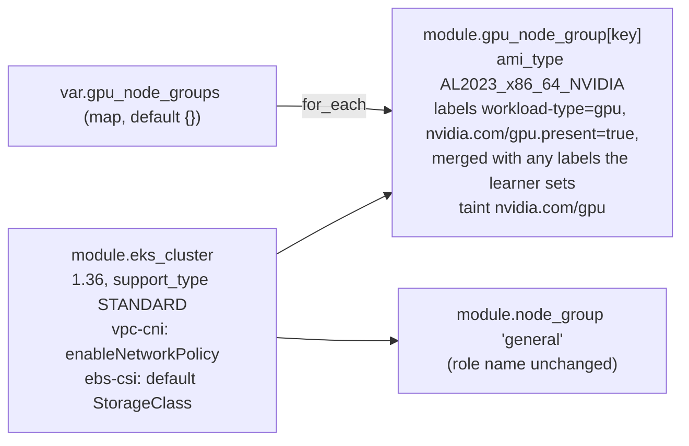

# P0/P1 correctness fixes, part 1 — EKS platform

## Goal

Make the `eks/` stack match what the exercises and README promise. It should run a Kubernetes version that is in standard support, cost what the README says, create the GPU node group the GPU track depends on, and ship the add-on settings that exercises 04 and 11 need. It also adds a LICENSE. Once this lands, parts 2 (`2026-09-14-p0-p1-correctness-fixes-2-core-exercises.md`) and 3 (`2026-09-14-p0-p1-correctness-fixes-3-gpu-track.md`) can fix the exercise content against a platform that works. The research note `~/notes/research/2026-09-14-kubernetes-dojo-critical-review.md` explains why.

## Decision

This spec takes option B from the research's Recommendation: fix P0/P1 now, move exercises 01–12 to kind with CI later. It covers the platform half of Recommendation steps 1–2; the kind move and CI (step 3) and P2 (step 4) get their own specs. Rejected: A (patch on EKS only) keeps paying EKS for exercises that don't need AWS; C (narrow the repo) drops most of the content; D (do nothing) leaves a cluster that bills at extended-support rates.

Choices made at interview (2026-09-14): the EBS CSI add-on creates the default StorageClass (not a new ex 04 step, not an exercise renumber); acceptance is kind for the core exercises, `terraform plan` for Terraform, and one short EKS run as the final gate; the licence is Apache-2.0.

## Background

Read at `f086d6b` on 2026-09-14; `origin/main` is the same commit. Square-bracket numbers are sources in the research note; those that are commands rather than pages (pricing API calls, `terraform console`, `gh api`) have no URL to give. That note is `status: final`, and its Verification table confirms 16 of 17 claims. Borrowed claims that the table confirms carry no mark; claims it doesn't check are marked *(unverified)*. Facts the research doesn't cover were read from the linked AWS, Kubernetes and GitHub pages on 2026-09-14.

- **Version.** `kubernetes_version` defaults to `"1.31"` (`eks/variables.tf:13-17`). The cluster resource sets no `upgrade_policy` (`eks/modules/eks_cluster/cluster.tf:26-62`). Other 1.31 pins are `eks/terraform.tfvars.example:13`, `eks/README.md:128` and the Cluster Autoscaler image `v1.31.0` at `exercises/18-autoscaling/manifests/cluster-autoscaler.yaml:163`, whose comment says to pin the minor version matching the cluster (`:161-162`). According to the [EKS version lifecycle](https://docs.aws.amazon.com/eks/latest/userguide/kubernetes-versions.html) [1], 1.31 left standard support on 2025-11-26, and 1.36 has standard support until 2027-08-02 *(unverified: only the 1.31 date is in the Verification table; S1 checks it)*. [Extended support pricing](https://aws.amazon.com/blogs/containers/amazon-eks-extended-support-for-kubernetes-versions-pricing/) [2] is $0.60 per cluster-hour, against $0.10 for standard. The lock file pins the AWS provider at 6.39.0 (`eks/.terraform.lock.hcl:4-6`).
- **Upgrade policy.** The provider accepts `upgrade_policy { support_type = "STANDARD" }` ([UpgradePolicyRequest](https://docs.aws.amazon.com/eks/latest/APIReference/API_UpgradePolicyRequest.html) [3]), and the default is `EXTENDED` ([CloudFormation UpgradePolicy](https://docs.aws.amazon.com/AWSCloudFormation/latest/TemplateReference/aws-properties-eks-cluster-upgradepolicy.html)). With `STANDARD`, EKS upgrades the cluster automatically when its version leaves standard support ([cluster upgrade policy](https://docs.aws.amazon.com/eks/latest/userguide/view-upgrade-policy.html)). A cluster that has already entered extended support can't be switched to `STANDARD` ([enable extended support](https://docs.aws.amazon.com/eks/latest/userguide/enable-extended-support.html): "Once your cluster has entered extended support, you cannot disable it"; [cluster upgrade policy](https://docs.aws.amazon.com/eks/latest/userguide/view-upgrade-policy.html): "To change the version support policy setting, your cluster must be running on a Kubernetes version in standard support"). Neither page says what happens when a cluster is *created* on a version already in extended support with `STANDARD`. That this is rejected is an *(assumption)*; the EKS gate's policy probe (Design) tests it.
- **Expiry of the default.** Once 1.36 leaves standard support (2027-08-02, *(unverified)*, S1), two things follow from the bullets above. A running cluster is upgraded by EKS to the next minor version, but `kubernetes_version` still says 1.36, so the next `plan` asks for a downgrade, which EKS can't do (next bullet). And if the policy probe shows that creation is rejected, every fresh `apply` of the default fails from that date. There is no CI to flag either (Non-goals), so the date has to be written down where a maintainer and a learner will see it (W1).
- **Upgrades and skew.** EKS updates a cluster one minor version at a time ([update a cluster](https://docs.aws.amazon.com/eks/latest/userguide/update-cluster.html)), and can't downgrade ([AWS re:Post](https://repost.aws/knowledge-center/eks-upgrade-cluster-add-custom-controllers)). kubectl "is supported within one minor version (older or newer) of kube-apiserver" ([version skew policy](https://kubernetes.io/releases/version-skew-policy/#kubectl)).
- **Cluster Autoscaler tag.** The newest `v1.36` tag of `registry.k8s.io/autoscaling/cluster-autoscaler` on 2026-09-14 is `v1.36.1`, from `curl -sL https://registry.k8s.io/v2/autoscaling/cluster-autoscaler/tags/list | jq -r '.tags[]' | grep '^v1\.36\.'`. The image isn't the only change. Upstream's AWS example manifest gained two ClusterRole rules between the two tags: `diff <(curl -sL https://raw.githubusercontent.com/kubernetes/autoscaler/cluster-autoscaler-1.31.0/cluster-autoscaler/cloudprovider/aws/examples/cluster-autoscaler-autodiscover.yaml) <(curl -sL https://raw.githubusercontent.com/kubernetes/autoscaler/cluster-autoscaler-1.36.1/cluster-autoscaler/cloudprovider/aws/examples/cluster-autoscaler-autodiscover.yaml)` shows `volumeattachments` added to the `storage.k8s.io` rule, and a new `resource.k8s.io` rule for `deviceclasses`, `resourceslices` and `resourceclaims` (`watch`, `list`, `get`). It also shows the example's image line changing, which isn't kept in step with the tag and can be ignored. The repo's ClusterRole has neither rule (`exercises/18-autoscaling/manifests/cluster-autoscaler.yaml:58-60`). What 1.36.1 does without them (log errors, or fail to start) is unknown; W1 adds them rather than finding out.
- **Cost table.** `README.md:229-239` gives ~$203/month, with $73 for the control plane. The tip at `README.md:243` (one AZ) fails validation, because at least two AZs are required (`eks/variables.tf:37-40`). The same tip is the second of the three answers to knowledge-check question 11 (`eks/README.md:176`, answers at `:202-205`). The NAT comment at `eks/modules/vpc/nat.tf:3-4` says "set the count to 1", but the count is `length(var.availability_zones)` (`:7`, `:18`), so only `availability_zones` sets it, and its validation requires at least two (`eks/variables.tf:37-40`). There is one EIP per AZ (`eks/modules/vpc/nat.tf:6-8`).
- **Costs outside the table.** The cluster sends all five control-plane log types to CloudWatch (`eks/modules/eks_cluster/cluster.tf:48-54`), and `git grep -n cloudwatch_log_group -- eks` finds nothing, so EKS creates the log group itself. CloudWatch logs never expire by default ([EKS control-plane logs](https://aws.amazon.com/blogs/containers/understanding-and-cost-optimizing-amazon-eks-control-plane-logs/)). That the group outlives `terraform destroy` is an *(assumption)*; the EKS gate checks it. Neither the research nor this spec has a figure for what the logs cost to ingest. The audit log is one of the five, so the figure may not be small. The gate measures it (Design), because a table that leaves out an unmeasured line doesn't meet the Goal. NAT gateways also charge $0.05 per GB processed [6] *(unverified)*.
- **GPU node groups.** `gpu-ml/README.md:44-66` tells learners to set `gpu_node_groups` in `terraform.tfvars`. `git grep -n gpu -- 'eks/*.tf' 'eks/modules'` finds nothing, and Terraform only warns "Value for undeclared variable" [9] *(unverified)*. The module takes no AMI type, labels or taints (`eks/modules/node_group/node_group.tf:50-90`, `eks/modules/node_group/variables.tf:1-57`). It names its IAM role `${var.cluster_name}-node-group-role` (`eks/modules/node_group/iam.tf:7-9`), so a second instance would collide. The research doesn't mention this collision. The architecture diagram shows that role name three times (`eks/architecture.svg:79`, `:178`, `:201`). `eks/main.tf:30-43` calls the module once. Scaling ignores `desired_size` after creation (`eks/modules/node_group/node_group.tf:74-78`), and the GPU README scales with `aws eks update-nodegroup-config` (`gpu-ml/README.md:68-74`).
- **GPU blocks learners already have.** Anyone who followed `gpu-ml/README.md:44-66` has that block in `eks/terraform.tfvars`, which is gitignored (`.gitignore:7`), so no grep of the repo finds it. Today Terraform ignores it. Once W3 declares the variable, it takes effect as written on the next `apply`. `desired_size = 1` (`gpu-ml/README.md:52`) launches a g4dn.xlarge straight away; on an account whose G and VT quota is still 0, the node group fails to create instead, and the apply fails. `labels` holds only `workload-type` (`:54-56`). For an `optional()` object attribute, Terraform uses the default only when the attribute is omitted ([type constraints](https://developer.hashicorp.com/terraform/language/expressions/type-constraints#optional-object-type-attributes)), so a label default declared that way would be replaced by this map, dropping the label the device plugin needs ("Device-plugin affinity", below).
- **What the GPU exercises expect.** They expect a node group named `gpu` (`gpu-ml/README.md:72`), the label `workload-type=gpu` and the taint `nvidia.com/gpu=present:NoSchedule` (`gpu-ml/README.md:54-63`; the taint at `gpu-ml/exercises/01-gpu-node-setup/README.md:28-34` and the label at `gpu-ml/exercises/01-gpu-node-setup/README.md:50`; `gpu-ml/exercises/03-distributed-training/manifests/distributed-training-job.yaml:13-18`). The suggested `desired_size = 1` (`gpu-ml/README.md:52`) contradicts the warning to keep it at 0 (`:68`). The [EKS accelerated AMI docs](https://docs.aws.amazon.com/eks/latest/userguide/ml-eks-optimized-ami.html) [10] say AL2023 NVIDIA AMIs "do not include the NVIDIA Kubernetes device plugin" (the research's Verification table doesn't check this; the page, read on 2026-09-14, still says it). A g4dn.xlarge in eu-west-2 is $0.615/h [5].
- **Device-plugin affinity.** Exercise 01 installs the NVIDIA device plugin with Helm, overriding only its tolerations (`gpu-ml/exercises/01-gpu-node-setup/README.md:103-110`). At commit d415f49 the chart's default affinity schedules the DaemonSet only on nodes labelled `feature.node.kubernetes.io/pci-10de.present=true`, `feature.node.kubernetes.io/cpu-model.vendor_id=NVIDIA` or `nvidia.com/gpu.present=true` ([values.yaml#L71-L92](https://github.com/NVIDIA/k8s-device-plugin/blob/d415f49223cb9344081cf167461ea0eada141695/deployments/helm/nvidia-device-plugin/values.yaml#L71-L92)). The chart's comments there say Node Feature Discovery sets the first two, and nothing in the repo installs it (`git grep -n -i 'node-feature-discovery\|nfd' -- eks gpu-ml` finds nothing). That EKS doesn't set the third label itself is an *(assumption)*; setting it in W3 is harmless either way.
- **GPU quota.** EC2's "Running On-Demand G and VT instances" quota defaults to 0 vCPUs ([EC2 instance quotas](https://docs.aws.amazon.com/ec2/latest/instancetypes/ec2-instance-quotas.html)), and EC2 raises quotas with usage, so each account's value differs. A g4dn.xlarge uses 4 vCPUs ([AWS re:Post](https://repost.aws/knowledge-center/ec2-on-demand-instance-vcpu-increase)). This part's checks need 4; part 3's W4 runs two GPU nodes in the same gate run, so the gate needs 8. `list-service-quotas` can't be used to read it: "If the applied quota value is not available for a quota, the quota is not retrieved" ([ListServiceQuotas](https://docs.aws.amazon.com/servicequotas/2019-06-24/apireference/API_ListServiceQuotas.html)), so an account still on the default can print nothing. [GetServiceQuota](https://docs.aws.amazon.com/servicequotas/2019-06-24/apireference/API_GetServiceQuota.html) carries the same caveat, so S3 falls back to the AWS default value.
- **Add-ons.** `vpc-cni` has no configuration (`eks/modules/eks_cluster/addons.tf:5-11`), so network policy is off. Exercise 11 turns it on with an `aws eks update-addon` call outside Terraform (`exercises/11-network-policies/README.md:36-42`). The EBS CSI add-on sets no configuration either (`eks/modules/eks_cluster/addons.tf:32-43`). No add-on sets `addon_version`, and the [CreateAddon](https://docs.aws.amazon.com/eks/latest/APIReference/API_CreateAddon.html) reference doesn't say which version EKS then installs, so S2 checks both the default and the newest version for 1.36. The exercise 04 StatefulSet names no StorageClass (`exercises/04-daemonsets-and-statefulsets/manifests/statefulset.yaml:49-56`). The only default class comes from exercise 07 (`exercises/07-persistent-storage/manifests/storage-class.yaml:5-7`), whose own PVC names its class explicitly (`exercises/07-persistent-storage/manifests/pvc.yaml:10`). Per the [EKS user guide at 7a6fff5](https://github.com/awsdocs/amazon-eks-user-guide/blob/7a6fff55817866896fe526d1ba92025ebf5e73d8/latest/ug/versioning/kubernetes-versions-extended.adoc#L91) [12], from 1.30 on, `gp2` is not the default. The same line points to `defaultStorageClass.enabled` on `aws-ebs-csi-driver` add-on 1.31.0 or later as the replacement.
- **Licence.** `git ls-files | grep -i licen` finds nothing. The repo is public [25].
- **Research corrections.** The research's "On 1.36" total of ~$232 doesn't add up from its own rows. Derived from its unit prices: $73.00 control plane (0.10 × 730), $68.91 for two t3.medium (2 × 0.0472 × 730), $73.00 for two NAT gateways (2 × 0.05 × 730), $7.30 for two IPv4 addresses (2 × 0.005 × 730), and $9.28 of gp3 (100 GB, from 50 GB × 2 nodes at `eks/variables.tf:83-87,101-105`, × 0.0928). That totals $231.49, so ~$231. The unit prices are [2][4][5][6][7], all confirmed, and [8], the gp3 rate *(unverified)*.

## Non-goals

- Moving exercises 01–12 to kind, and adding CI (research Recommendation step 3; a later spec).
- Pod Identity, Karpenter, VPA `InPlaceOrRecreate`, DRA, and the CKA coverage gaps (step 4).
- Cluster Autoscaler scale-from-zero tags for the GPU group, and a single-NAT option.
- Upgrading existing 1.31 clusters in place (see Risks).
- Managing the control-plane log group in Terraform (retention, deletion on destroy). W2 documents it instead.
- Moving `reports/` out of the learner path.

## Design

The general node group keeps its IAM role name, `k8s-dojo-node-group-role`, which the architecture diagram shows as `{cluster}-node-group-role`. This isn't about keeping existing state, because an existing cluster has to be recreated anyway (see Risks). GPU groups reuse the module through `for_each`, with their own role names, and with a label that the device-plugin chart's default affinity accepts.

- **Tools.** Terraform 1.9.0 or later (`eks/versions.tf:2`), AWS CLI v2 with credentials, `jq` and `curl`. The EKS run adds kubectl 1.35 or later. The spikes need nothing else.
- **Plans.** Run `terraform -chdir=eks init`, then `terraform -chdir=eks workspace new spec-check`, so that every plan runs against empty state, even in a checkout that has applied before. The workspace's state directory is gitignored (`.gitignore:6`), and so are plan files (`.gitignore:14`). When done, run `terraform -chdir=eks workspace select default` and `terraform -chdir=eks workspace delete spec-check`. Plan needs AWS credentials for the provider, but creates nothing.
- **EKS gate.** This is the one EKS run the Decision calls for, and parts 2 and 3 run their EKS checks in it too: part 2 for exercises 04, 11 and 13–18, and part 3 for the GPU exercises, with two GPU nodes for its W4. So it runs once all three parts pass their plan and kind checks, and before any of them merges. Part 1 then merges first, as parts 2 and 3 both require, and 2 and 3 follow in either order. Budget a day (Effort). Once S3 shows 8 vCPUs of G and VT quota:
  1. Note the time, then run one `terraform apply` in the default workspace, with `gpu_node_groups = { gpu = { instance_types = ["g4dn.xlarge"] } }`.
  2. Run this part's EKS checks with one GPU node, then parts 2 and 3's. Scale to two GPU nodes only for part 3's W4, and back to 0 afterwards.
  3. **Policy probe** (Background, "Upgrade policy"). Get the gate cluster's role and subnets with `aws eks describe-cluster --name k8s-dojo --region eu-west-2 --query 'cluster.[roleArn,resourcesVpcConfig.subnetIds]'`. List the versions in extended support with `aws eks describe-cluster-versions --version-status EXTENDED_SUPPORT --region eu-west-2 --query 'clusterVersions[].clusterVersion'`, and pick one. Then run `aws eks create-cluster --name k8s-dojo-policy-probe --kubernetes-version <that version> --role-arn <role> --resources-vpc-config subnetIds=<subnet1>,<subnet2> --upgrade-policy supportType=STANDARD --region eu-west-2`.
     - If the call is rejected, record the error message: the assumption holds.
     - If it's accepted, run `aws eks wait cluster-active --name k8s-dojo-policy-probe --region eu-west-2`, and record the output of `aws eks describe-cluster --name k8s-dojo-policy-probe --region eu-west-2 --query 'cluster.[version,upgradePolicy.supportType]'`. Then run `aws eks delete-cluster --name k8s-dojo-policy-probe --region eu-west-2` and `aws eks wait cluster-deleted --name k8s-dojo-policy-probe --region eu-west-2`. The wait must finish before step 5, because the probe puts network interfaces in the gate's subnets *(assumption)*.

     Either way, the result decides the wording of W1's variable description, W1's upkeep paragraph and the Risks entries that cite the probe.
  4. **Log volume.** Run `aws cloudwatch get-metric-statistics --namespace AWS/Logs --metric-name IncomingBytes --dimensions Name=LogGroupName,Value=/aws/eks/k8s-dojo/cluster --start-time <time from step 1> --end-time <now> --period 3600 --statistics Sum --region eu-west-2`. Add up the datapoints, divide by the hours since step 1 and by 1024³, and multiply by 730, for GB a month. W2 turns that into its CloudWatch row. The run is busier than an idle cluster, so the figure is an upper bound for a cluster left idle *(assumption)*.
  5. Run `terraform destroy`, then check `aws logs describe-log-groups --log-group-name-prefix /aws/eks/k8s-dojo/ --region eu-west-2`. If it still lists the group, W2's README line keeps its "delete it after destroy" clause; if not, drop that clause. Either way, finish with `aws logs delete-log-group --log-group-name /aws/eks/k8s-dojo/cluster --region eu-west-2`.

## Work items

### W1: Kubernetes 1.36 on standard support

- **Change:**
  - Default `kubernetes_version` to `"1.36"`. The description gives `"1.36"` as its example, and says to use a version in EKS standard support, because the `STANDARD` policy can't be set on a cluster already in extended support (Background). What it says about *creating* a cluster on such a version follows the gate's policy probe (Design): if the probe was rejected, it says `apply` fails; if not, it says what the probe showed. Until the gate has run, it makes no claim about creation.
  - Add `upgrade_policy { support_type = "STANDARD" }` to `aws_eks_cluster.this`. Comment it with:
    - the price difference ([pricing](https://aws.amazon.com/blogs/containers/amazon-eks-extended-support-for-kubernetes-versions-pricing/) [2]);
    - the automatic upgrade at the end of standard support ([cluster upgrade policy](https://docs.aws.amazon.com/eks/latest/userguide/view-upgrade-policy.html));
    - the date the default leaves standard support (S1), after which `kubernetes_version` has to be raised to the version EKS moved the cluster to before the next `apply`, because otherwise Terraform asks for a downgrade (Background, "Expiry of the default").
  - Update the 1.31 pins in the tfvars example and the variables table.
  - Bump the Cluster Autoscaler image to `v1.36.1`, and add the two ClusterRole rules that upstream's manifest gained between the tags (Background, "Cluster Autoscaler tag"). Add `volumeattachments` to the `storage.k8s.io` rule (`exercises/18-autoscaling/manifests/cluster-autoscaler.yaml:58-60`). After that rule, add `apiGroups: ["resource.k8s.io"]`, with resources `deviceclasses`, `resourceslices` and `resourceclaims` and verbs `watch`, `list` and `get`.
  - Add a `### Existing clusters` subsection at the end of `eks/README.md`, after "Destroying the Cluster" (`eks/README.md:211-217`), so no earlier line moves. It says that a cluster created before this change needs `terraform destroy`, then `apply`, because EKS updates one minor version at a time. Word it without a version string, so W1's grep stays clean. A second paragraph gives the date the default leaves standard support (S1), and says what happens then:
    - A cluster still running is upgraded by EKS. Before the next `apply`, set `kubernetes_version` to the version that `aws eks describe-cluster --name <cluster> --query cluster.version` prints.
    - The repo's default has to be raised before that date. If the policy probe was rejected, add that a fresh `apply` of the old default fails after it.
  - Raise the `kubectl >= 1.29` prerequisite (`eks/README.md:37`, `gpu-ml/README.md:28`) to `>= 1.35`, one minor version below the cluster, which the skew policy supports (Background).
- **Files:** `eks/variables.tf`, `eks/modules/eks_cluster/cluster.tf`, `eks/terraform.tfvars.example`, `eks/README.md`, `gpu-ml/README.md`, `exercises/18-autoscaling/manifests/cluster-autoscaler.yaml`
- **Done when:**
  - `terraform -chdir=eks validate` prints `Success! The configuration is valid.`
  - In the `spec-check` workspace (Design), `terraform -chdir=eks plan -out=p.tfplan`, then `terraform -chdir=eks show -json p.tfplan | jq '.resource_changes[] | select(.address=="module.eks_cluster.aws_eks_cluster.this") | .change.after | {version, upgrade_policy}'`, prints version `"1.36"` and `support_type` `"STANDARD"`.
  - `git grep -n '1\.31' -- eks exercises/18-autoscaling` prints nothing.
  - `git grep -n '1\.29' -- eks/README.md gpu-ml/README.md` prints nothing.
  - `grep -n '^## Destroying the Cluster\|^### Existing clusters' eks/README.md` prints the Destroying heading first, then the new subsection.
  - `git grep -n '2027-08-02' -- eks/README.md eks/modules/eks_cluster/cluster.tf` prints the upkeep paragraph and the `upgrade_policy` comment. If S1 gives a different date, grep for that one instead.
  - `grep -c 'volumeattachments\|"resource.k8s.io"' exercises/18-autoscaling/manifests/cluster-autoscaler.yaml` prints `2`.
  - EKS run: `aws eks describe-cluster --name k8s-dojo --query 'cluster.[version,upgradePolicy.supportType]'` prints `["1.36","STANDARD"]`.
  - EKS run, during part 2 W4's exercise 18 check: `kubectl -n kube-system logs deploy/cluster-autoscaler | grep -c forbidden` prints `0`.
  - After the gate: the variable description and the upkeep paragraph state what the policy probe found, and this spec's Background and Risks no longer mark it *(assumption)*.

### W2: Honest cost table and cost tips

- **Change:**
  - Replace the table at `README.md:229-239` with the derived rows in Background (~$231), plus a **CloudWatch control-plane logs** row. That row is the gate's GB a month (Design, step 4) × the eu-west-2 ingestion price for standard logs, from the [CloudWatch pricing page](https://aws.amazon.com/cloudwatch/pricing/) on the day the row is written, rounded to the dollar. The total includes it. Until the gate has run, the row reads "measured in the EKS test run" and the total reads "~$231 plus logs"; both are replaced before part 1 merges.
  - Below the table, add one line on what the total leaves out: NAT data processing ($0.05/GB [6] *(unverified)*), load balancers, GPU nodes (W3), and log storage, which keeps growing because the log group `/aws/eks/<cluster>/cluster` never expires by default. Say (if the EKS gate confirms it) that the group outlives `terraform destroy`, so delete it afterwards.
  - Add one line: pinning a version past standard support raises the control plane from $73 to $438 a month (0.60 × 730) ([pricing](https://aws.amazon.com/blogs/containers/amazon-eks-extended-support-for-kubernetes-versions-pricing/) [2]).
  - Delete the one-AZ tip at `README.md:243`.
  - In knowledge-check answer 11, replace the one-AZ answer (`eks/README.md:204`) with a third change, so the answer still lists the three that question 11 asks for (`:176`). The new answer: **run one node**, with `node_desired_count = 1` before the first apply, or `aws eks update-nodegroup-config` afterwards, because Terraform ignores desired size once the group exists (`eks/modules/node_group/node_group.tf:74-78`). It saves ~$34/month (0.0472 × 730); the trade-off is no second node to spread Pods across or fail over to.
  - Fix the NAT comment at `eks/modules/vpc/nat.tf:3-4` to say that NAT gateways follow `availability_zones`, which needs at least two entries.
- **Files:** `README.md`, `eks/README.md`, `eks/modules/vpc/nat.tf`
- **Done when:**
  - `grep -n '203\|eu-west-2a"\]' README.md` prints nothing.
  - `grep -n 'eu-west-2a"\]' eks/README.md` prints nothing.
  - `sed -n '/^11\. Three cost-reducing/,/^12\./p' eks/README.md | grep -c '^    - \*\*'` prints `3`.
  - `grep -n 'data processing' README.md` and `grep -n 'log group' README.md` each print the new exclusions line.
  - The table's rows sum to its stated total; check by hand in review.
  - Before part 1 merges: `grep -n 'CloudWatch' README.md` prints the row with a dollar figure, and `grep -n 'measured in the EKS test run\|plus logs' README.md` prints nothing. The row's figure is the gate's GB a month × the price, which can be checked by hand from the numbers recorded at the gate.
  - `grep -n 'count to 1' eks/modules/vpc/nat.tf` prints nothing.

### W3: GPU node groups in Terraform

- **Change:**
  - **Module.** In `eks/modules/node_group`, add these inputs:
    - `ami_type` (string, default `null`)
    - `labels` (map(string), default `{}`)
    - `taints` (list of `{key, value, effect}`, default `[]`)
    - `iam_role_name` (string, default `null`)
  - In `aws_eks_node_group.this`, set `ami_type` and `labels`, and add a `dynamic "taint"` block.
  - Change the role name to `coalesce(var.iam_role_name, "${var.cluster_name}-node-group-role")`, so the general group's role keeps its name.
  - **Root.** Add `gpu_node_groups` as a `map(object(...))` with default `{}`, using the field names at `gpu-ml/README.md:47-65`:
    - `instance_types`
    - `capacity_type`: optional, default `"ON_DEMAND"`
    - `min_size`: optional, default 0
    - `desired_size`: optional, default 0
    - `max_size`: optional, default 2
    - `disk_size_gb`: optional; null falls back to `var.node_disk_size_gb`
    - `labels`: optional, default `{}`. The module call passes `merge({ "workload-type" = "gpu", "nvidia.com/gpu.present" = "true" }, each.value.labels)`, so a learner's labels are added to these two rather than replacing them, and a learner can still override either key on purpose. The exercises select on the first; the second satisfies the device-plugin chart's default affinity (Background). Don't declare these two as the attribute's `optional()` default: a learner's map would then replace them (Background, "GPU blocks learners already have").
    - `taints`: optional, default `nvidia.com/gpu=present`, `NO_SCHEDULE`
  - Validate `capacity_type` and taint `effect` against their allowed values.
  - Add `module "gpu_node_group"` with `for_each = var.gpu_node_groups`, `node_group_name = each.key`, `ami_type = "AL2023_x86_64_NVIDIA"` ([EKS API: Nodegroup](https://docs.aws.amazon.com/eks/latest/APIReference/API_Nodegroup.html) [31]) and `iam_role_name = "${var.cluster_name}-${each.key}-node-group-role"`.
  - Add a commented example to the tfvars file and a row to the variables table.
  - **Docs.** Rewrite `gpu-ml/README.md:44-74` around the declared shape:
    - `desired_size = 0`, with labels and taints defaulting to what the exercises and the device-plugin chart expect;
    - ~$449/month per g4dn.xlarge left running (0.615 × 730; the rate is research [5], a price-list API call);
    - before scaling up, check that the account's G and VT quota covers 4 vCPUs per node (S3's two commands, including the fallback to the default), and request an increase if it doesn't;
    - the AMI has no device plugin ([EKS accelerated AMI docs](https://docs.aws.amazon.com/eks/latest/userguide/ml-eks-optimized-ami.html) [10]), and exercise 01 installs it (part 3);
    - a warning, placed before the new example: if `eks/terraform.tfvars` already has a `gpu_node_groups` block copied from an earlier version of this README, the next `apply` acts on it. Set its `desired_size` to 0 first, or the apply starts a GPU node (or fails, if the quota is short), and delete its `labels` unless you need extra ones.
  - Add the same warning, in one sentence, to W1's `### Existing clusters` subsection in `eks/README.md`, since a learner recreating the cluster reads that, not the GPU README.
- **Files:**
  - `eks/modules/node_group/variables.tf`
  - `eks/modules/node_group/node_group.tf`
  - `eks/modules/node_group/iam.tf`
  - `eks/variables.tf`
  - `eks/main.tf`
  - `eks/terraform.tfvars.example`
  - `eks/README.md`
  - `gpu-ml/README.md`
- **Done when:**
  - `terraform -chdir=eks validate` passes.
  - In the `spec-check` workspace, with default variables, the plan JSON has no address containing `gpu_node_group`, and `module.node_group.aws_iam_role.node_group` has name `k8s-dojo-node-group-role`.
  - With a scratch `-var-file` holding `gpu_node_groups = { gpu = { instance_types = ["g4dn.xlarge"] } }`, the plan prints no `undeclared variable` warning. `module.gpu_node_group["gpu"].aws_eks_node_group.this` then shows:
    - `ami_type` `AL2023_x86_64_NVIDIA`;
    - labels `{"nvidia.com/gpu.present":"true","workload-type":"gpu"}`;
    - one taint `nvidia.com/gpu`/`present`/`NO_SCHEDULE`;
    - `desired_size` 0.

    Its role is named `k8s-dojo-gpu-node-group-role`.
  - With a scratch `-var-file` holding the old README block verbatim, from `git show f086d6b:gpu-ml/README.md | sed -n '47,65p'`, the same node group's labels still include `"nvidia.com/gpu.present":"true"`. Its `desired_size` shows 1, which the old block sets, and which the new warning covers.
  - `grep -n -i 'earlier version' gpu-ml/README.md eks/README.md` prints the warning in both files.
  - EKS run, once S3 shows at least 4 vCPUs: after `aws eks update-nodegroup-config --cluster-name k8s-dojo --nodegroup-name gpu --scaling-config desiredSize=1`, `kubectl get nodes -l workload-type=gpu,nvidia.com/gpu.present=true` lists one `Ready` node within 15 minutes, and `kubectl get node <name> -o jsonpath='{.spec.taints}'` shows the taint.

### W4: Add-on settings for network policy and a default StorageClass

- **Change:**
  - On `aws_eks_addon.vpc_cni`, set `configuration_values = jsonencode({ enableNetworkPolicy = "true" })`. This is the key exercise 11 already passes (`exercises/11-network-policies/README.md:40`).
  - On `aws_eks_addon.ebs_csi_driver`, set `configuration_values = jsonencode({ defaultStorageClass = { enabled = true } })`. This is the parameter the EKS user guide names, for add-on version 1.31.0 or later ([user guide at 7a6fff5, line 91](https://github.com/awsdocs/amazon-eks-user-guide/blob/7a6fff55817866896fe526d1ba92025ebf5e73d8/latest/ug/versioning/kubernetes-versions-extended.adoc#L91) [12]). S2 confirms the key in the schemas of both the default and the newest add-on version for 1.36 (Background, "Add-ons"). Keep the add-on's version number out of any comment in `eks/`, so W1's `1\.31` grep stays clean.
  - Drop the `is-default-class` annotation from `exercises/07-persistent-storage/manifests/storage-class.yaml:5-7`, so there's only one default.
  - Rewrite `exercises/07-persistent-storage/README.md:51-56` to show the add-on's default class, and why the exercise PVC names `gp3-encrypted` explicitly.
  - Update the add-on list in `eks/README.md:24-29` and `:147`.
- **Files:** `eks/modules/eks_cluster/addons.tf`, `exercises/07-persistent-storage/manifests/storage-class.yaml`, `exercises/07-persistent-storage/README.md`, `eks/README.md`
- **Done when:**
  - The plan JSON shows non-null `configuration_values` on `module.eks_cluster.aws_eks_addon.vpc_cni` and `module.eks_cluster.aws_eks_addon.ebs_csi_driver`.
  - `grep -n is-default-class exercises/07-persistent-storage/manifests/storage-class.yaml` prints nothing.
  - EKS run: `kubectl get storageclass` shows exactly one `(default)`.
  - EKS run: after `kubectl apply -f exercises/04-daemonsets-and-statefulsets/manifests/statefulset.yaml`, `kubectl get pvc -l app=web` shows three `Bound` PVCs within 5 minutes.
  - EKS run: `aws eks describe-addon --cluster-name k8s-dojo --addon-name vpc-cni --query addon.configurationValues --output text` contains `enableNetworkPolicy`.

### W5: Apache-2.0 LICENSE

- **Change:** Add `LICENSE` containing the verbatim text of https://www.apache.org/licenses/LICENSE-2.0.txt, and a two-line "Licence" section at the end of `README.md`.
- **Files:** `LICENSE` (new), `README.md`
- **Done when:**
  - `diff <(curl -s https://www.apache.org/licenses/LICENSE-2.0.txt) LICENSE` prints nothing.
  - After the change is merged to the default branch, where GitHub detects licences, `gh api repos/ChrisAdkin8/kubernetes-dojo --jq .license.spdx_id` prints `Apache-2.0`.

## Effort

| Item | Estimate | Depends on |
|---|---|---|
| W1 | 1–1.5 h plus S1 | — |
| W2 | 30 min, plus the CloudWatch row after the gate | W1; the EKS gate for the CloudWatch row |
| W3 | 3–4 h | W1 (the `Existing clusters` subsection) |
| W4 | 1 h plus S2 | — |
| W5 | 15 min | — |
| EKS gate run | a day, under $10 (below) | W1–W4, S3, and parts 2 and 3 through their plan and kind checks |

These are estimated from reading the code, not from doing the work, so trust the ordering more than the numbers. W1–W4 each land as one change; the EKS run checks them together with parts 2 and 3 (Design). The run costs about $0.32/h for the base cluster (the Background total ÷ 730), plus $0.615 per GPU node-hour. The policy probe costs less than one hour of control plane at the extended-support rate, $0.60 [2]. For about eight hours, with some five GPU node-hours across this part and part 3, that comes to about $6–7 *(estimate)*. S3 can add lead time: if the quota is short, request the increase before booking the gate, as AWS may take hours or days to grant it *(assumption)*.

## Spike questions

- **S1. Is EKS 1.36 offered in eu-west-2, when does its standard support end, and is there an AL2023 NVIDIA AMI for it?** Run `aws eks describe-cluster-versions --cluster-versions 1.36 --region eu-west-2 --query 'clusterVersions[0].[versionStatus,endOfStandardSupportDate]'`. The status must be `STANDARD_SUPPORT`, and the date settles the *(unverified)* 2027-08-02 that W1's comment and upkeep paragraph use. Then run `aws ssm get-parameter --name /aws/service/eks/optimized-ami/1.36/amazon-linux-2023/x86_64/nvidia/recommended/image_id --region eu-west-2 --query Parameter.Value --output text` ([retrieve AMI IDs](https://docs.aws.amazon.com/eks/latest/userguide/retrieve-ami-id.html)). Both are free. If either fails, use the newest version for which both succeed, and change W1's `1.36`, `1.35`, `v1.36.1` and the upkeep date to match. The Background `curl` lists the Cluster Autoscaler tags for any minor version; rerun the Background `diff` against that tag's manifest, in case the ClusterRole rules differ.
- **S2. What is the exact configuration key for the EBS CSI add-on's default StorageClass?** Terraform doesn't pin the add-on version (Background, "Add-ons"), so check both versions it could get.
  - List them with `aws eks describe-addon-versions --addon-name aws-ebs-csi-driver --kubernetes-version 1.36 --region eu-west-2 --query "addons[0].addonVersions[].[addonVersion, compatibilities[?clusterVersion=='1.36'].defaultVersion | [0]]" --output text`. The highest version is the newest; the row marked `True` is the default.
  - For each of the two, run `aws eks describe-addon-configuration --addon-name aws-ebs-csi-driver --addon-version <version> --region eu-west-2 --query configurationSchema --output text | jq '.properties | keys'`, and check that `defaultStorageClass` is listed.
  - Do the same for `vpc-cni` to confirm `enableNetworkPolicy`.

  If the key is missing from either version, W4 pins `addon_version` to one that has it. All of these are free API calls.
- **S3. Does the account have enough G and VT quota for the GPU checks?** An account still on the default may have no applied value (Background, "GPU quota"), so read it in two steps.
  1. `aws service-quotas list-aws-default-service-quotas --service-code ec2 --region eu-west-2 --query "Quotas[?QuotaName=='Running On-Demand G and VT instances'].[QuotaCode,Value]" --output text` prints the quota's code and AWS's default.
  2. `aws service-quotas get-service-quota --service-code ec2 --quota-code <code> --region eu-west-2 --query Quota.Value` prints the account's applied value. If it fails with `NoSuchResourceException`, the default from step 1 applies.

  The value must be at least 8 for the gate: 4 for this part's checks, and 8 for part 3's W4. If it's short, request an increase in the Service Quotas console before booking the gate. W3's README points learners at these same two commands. This is free.

## Risks and rollback

- **Existing 1.31 clusters.** After this change, a learner with a 1.31 cluster who runs `apply` asks EKS to jump five minor versions, and EKS updates one at a time (Background), so the apply fails. The cluster is also in extended support already, so it can't take `STANDARD` either. The W1 README note says to destroy and re-apply. The GPU node group is additive, unless the learner's `terraform.tfvars` already has a block (next entry). The add-on settings change the two existing add-ons in place.
- **GPU blocks already in `terraform.tfvars`.** A block copied from the old GPU README takes effect on the first `apply` after W3. Its `desired_size = 1` starts a GPU node at about $0.615/h, or fails the apply on an account with no G and VT quota (Background, "GPU blocks learners already have"). W3 merges the labels in code, so the old `labels` map no longer drops the device-plugin label, and warns about `desired_size` in both READMEs. Nothing in the repo can see a gitignored file, so the warning is the only mitigation.
- **Pinning an older version.** `STANDARD` can't be set on a cluster already in extended support (Background). That creating a cluster on such a version with `STANDARD` is rejected is an *(assumption)*, which the gate's policy probe settles (Design, step 3). W1's variable description states whatever the probe finds, and the Open question asks whether to make `support_type` a variable.
- **Automatic upgrade and expiry.** With `STANDARD`, a cluster still running when 1.36 leaves standard support is upgraded by EKS (Background). Node groups don't follow the control plane automatically ([AWS re:Post](https://repost.aws/knowledge-center/eks-upgrade-cluster-add-custom-controllers)). The next `plan` then asks for a downgrade, which fails until `kubernetes_version` is raised to match, as W1's comment and upkeep paragraph say. Learners who destroy between sessions never meet this. The default itself is a different matter: it has to be raised before that date, and if the probe shows creation is rejected, every new learner's first `apply` of the old default fails from then on. No check in this repo will notice (CI is a later spec), so the date in W1's upkeep paragraph is the only reminder. The CI spec should add a check that fails when `describe-cluster-versions` no longer reports the default as `STANDARD_SUPPORT`.
- **Role name.** `coalesce` keeps `k8s-dojo-node-group-role` for the general group, and W3's empty-state Done when checks the name.
- **Line numbers in parts 2 and 3.** W3 adds a row to the variables table (`eks/README.md:124-138`), W4 may lengthen the add-on list (`:24-29`), and W3 rewrites `gpu-ml/README.md:44-74`. So the lines that part 2 cites at `eks/README.md:192`, and part 3 at `gpu-ml/README.md:93`, `:118` and `:120`, will move. Both parts give anchor text to find them by. W1's new ClusterRole rule, added after `exercises/18-autoscaling/manifests/cluster-autoscaler.yaml:60`, also moves the lines part 2 W4 cites in that file below line 60, `:163` and `:173-174`, by the length of the rule. Part 2 gives no anchor text for them, so find them by their content: the `image:` line and the `--node-group-auto-discovery` line. W1's README note goes at the end of the file, so it moves nothing.
- **Rollback.** Revert the commit. W3 and W5 only add things. W1 and W4 change existing resources in place: the cluster's version and upgrade policy, and the `configuration_values` of the two add-ons. Reverting W1 on a cluster that is already on 1.36 means destroying and re-applying, because EKS can't downgrade (Background).

## Open questions

- Should `support_type` be a variable, so a learner can knowingly pin an older version? This spec hard-codes `STANDARD`, which can't be set on a cluster already in extended support; whether a new cluster can be created on such a version is what the gate's policy probe finds out (Risks).
