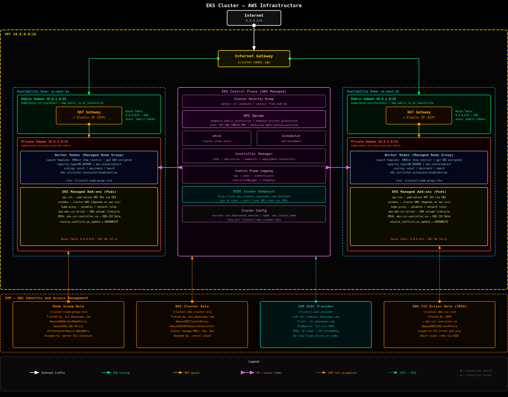

# EKS Cluster — Terraform

This directory contains a Terraform configuration that provisions a production-quality Amazon EKS cluster for use with the `kubernetes-dojo` exercises.

## Architecture



```
VPC (10.0.0.0/16)
├── Public subnets  (one per AZ) — NAT gateways, future load balancers
└── Private subnets (one per AZ) — EKS control plane ENIs, worker nodes

EKS Control Plane
├── Authentication mode: API_AND_CONFIG_MAP
├── OIDC provider (for IRSA)
└── CloudWatch logging: API, Audit, Authenticator, Controller, Scheduler

Managed Node Group "general"
├── IMDSv2 enforced (launch template)
├── Encrypted gp3 root volumes
└── IAM role with EKSWorkerNode + CNI + ECR + EBS CSI policies

Managed Add-ons
├── vpc-cni
├── coredns
├── kube-proxy
└── aws-ebs-csi-driver
```

## Prerequisites

| Tool | Version | Install |
|---|---|---|
| Terraform | >= 1.9.0 | https://developer.hashicorp.com/terraform/install |
| AWS CLI | >= 2.0 | https://docs.aws.amazon.com/cli/latest/userguide/getting-started-install.html |
| kubectl | >= 1.29 | https://kubernetes.io/docs/tasks/tools/ |

Configure your AWS credentials before running any Terraform commands:

```bash
aws configure
# or
export AWS_PROFILE=your-profile
```

Verify that your identity has the necessary IAM permissions (EKS full access, IAM role/policy creation, VPC creation, EC2 management).

## Deploying the Cluster

### 1. Create your tfvars file

```bash
cp terraform.tfvars.example terraform.tfvars
```

Edit `terraform.tfvars`. At minimum, set `region`:

```hcl
region = "eu-west-2"
```

To restrict API access to your IP only (recommended):

```hcl
cluster_endpoint_public_access_cidrs = ["YOUR.IP.HERE/32"]
```

### 2. Initialise Terraform

```bash
terraform init
```

### 3. Review the plan

```bash
terraform plan
```

You should see approximately 35–40 resources to be created.

### 4. Apply

```bash
terraform apply
```

This takes approximately 15–20 minutes. The EKS control plane takes ~10 minutes on its own.

### 5. Configure kubectl

After apply completes, run the output command:

```bash
$(terraform output -raw kubeconfig_command)
# expands to: aws eks update-kubeconfig --region eu-west-2 --name k8s-dojo
```

Verify connectivity:

```bash
kubectl get nodes
kubectl get pods -n kube-system
```

## Module Structure

```
eks/
├── versions.tf          — provider version constraints
├── main.tf              — module wiring
├── variables.tf         — all input variables with descriptions
├── outputs.tf           — cluster endpoint, OIDC ARN, kubeconfig command
├── terraform.tfvars.example
└── modules/
    ├── vpc/             — VPC, subnets, IGW, NAT GW, route tables
    ├── eks_cluster/     — IAM role, security group, EKS cluster, OIDC, add-ons
    └── node_group/      — IAM role, launch template, managed node group
```

## Variables

| Name | Default | Description |
|---|---|---|
| `region` | `eu-west-2` | AWS region |
| `cluster_name` | `k8s-dojo` | Name applied to all resources |
| `kubernetes_version` | `1.31` | EKS Kubernetes version |
| `vpc_cidr` | `10.0.0.0/16` | VPC CIDR block |
| `availability_zones` | `[eu-west-2a, eu-west-2b]` | AZs for subnet placement |
| `node_instance_types` | `[t3.medium]` | EC2 instance types for nodes |
| `node_desired_count` | `2` | Desired node count |
| `node_min_count` | `1` | Minimum node count |
| `node_max_count` | `4` | Maximum node count |
| `node_disk_size_gb` | `50` | Root EBS volume size |
| `node_capacity_type` | `ON_DEMAND` | `ON_DEMAND` or `SPOT` |
| `cluster_endpoint_public_access` | `true` | Expose API server publicly |
| `cluster_endpoint_public_access_cidrs` | `[0.0.0.0/0]` | Allowed CIDRs for public access |

## AWS Best Practices Applied

- **IMDSv2 enforced** — launch template sets `http_tokens = required` and `hop_limit = 1`, preventing SSRF attacks from reaching instance metadata.
- **Private worker nodes** — nodes run in private subnets and egress via NAT gateway; no public IPs on nodes.
- **Encrypted EBS volumes** — launch template enables EBS encryption on root volumes.
- **IRSA enabled** — OIDC provider created so ServiceAccounts can assume IAM roles without static credentials.
- **CloudWatch control-plane logs** — all five log types enabled for auditability.
- **Managed add-ons** — VPC CNI, CoreDNS, kube-proxy, and EBS CSI driver are managed by AWS and auto-patched.
- **Access entries** — authentication mode set to `API_AND_CONFIG_MAP`; the cluster creator receives admin permissions automatically.
- **Node autoscaler tags** — node group tagged for the [Cluster Autoscaler](https://github.com/kubernetes/autoscaler/tree/master/cluster-autoscaler/cloudprovider/aws).

## Knowledge Check

Answer these without looking at the Terraform code or AWS console:

**Networking**

1. Worker nodes are placed in private subnets with no public IP. What AWS resource allows them to reach the internet to pull container images, and why is one placed in each availability zone?
2. The VPC CNI plugin assigns a real VPC IP address to every Pod. What is the practical consequence of this for subnet sizing, and what happens if the subnet runs out of IPs?
3. The EKS control plane needs to communicate with worker nodes. What resource does it create in each private subnet to achieve this, and who owns those resources in your account?
4. Which two subnet tags does EKS require for automatic discovery, and what values must they hold?

**IAM and Authentication**

5. What is IRSA (IAM Roles for Service Accounts) and why is it preferable to attaching IAM policies directly to the node group's instance role?
6. An OIDC provider is created alongside the cluster. Explain its role in the chain that allows a Kubernetes ServiceAccount to assume an AWS IAM role.
7. The launch template sets `http_tokens = required` and `http_put_response_hop_limit = 1` for the instance metadata service. What attack does each setting mitigate?
8. The cluster uses `authentication_mode = API_AND_CONFIG_MAP`. What is the `aws-auth` ConfigMap, and what breaks if it is accidentally deleted?

**Add-ons and Node Group**

9. Four managed add-ons are installed: `vpc-cni`, `coredns`, `kube-proxy`, and `aws-ebs-csi-driver`. What happens if `aws-ebs-csi-driver` is absent and a Pod requests a PersistentVolumeClaim backed by a `gp3` StorageClass?
10. The node group is tagged with `k8s.io/cluster-autoscaler/enabled` and `k8s.io/cluster-autoscaler/<cluster-name>`. What reads these tags, and what must you separately deploy into the cluster before autoscaling works?

**Cost and Operations**

11. List three changes to this Terraform configuration that would meaningfully reduce the monthly running cost, and describe the trade-off each introduces.
12. You run `terraform destroy` and it succeeds, but two EBS volumes remain in your account. What created them, why did Terraform not delete them, and how do you prevent this in future?

<details>
<summary>Answers</summary>

1. A **NAT gateway** in the public subnet of each AZ allows nodes to initiate outbound connections (e.g. image pulls from ECR, API calls to AWS) without being directly reachable from the internet. One per AZ is needed for HA — if nodes in `eu-west-2b` route through a NAT in `eu-west-2a` and that AZ suffers an outage, those nodes lose internet access.

2. Every Pod consumes a real IP from the subnet CIDR. A `/24` gives 251 usable IPs; a busy node may have 30+ Pods. If the subnet is exhausted, new Pods stay `Pending` with the error `failed to assign an IP address`. Size subnets generously (at least `/21`) or use prefix delegation (`ENABLE_PREFIX_DELEGATION=true` on the VPC CNI) to carve /28 blocks per node.

3. The EKS control plane creates **Elastic Network Interfaces (ENIs)** in each private subnet you specify. These ENIs appear in your account under the `amazon-eks` owner description and must not be deleted manually — doing so severs control-plane-to-node communication.

4. Public subnets need `kubernetes.io/role/elb = 1` (for internet-facing load balancers). Private subnets need `kubernetes.io/role/internal-elb = 1` (for internal load balancers). Both subnets need `kubernetes.io/cluster/<cluster-name> = shared` (or `owned`) so EKS and the AWS Load Balancer Controller can discover them.

5. With IRSA, each ServiceAccount is bound to a specific IAM role via an annotation; only Pods using that ServiceAccount can assume that role, and only for the duration of the Pod. With node-level instance profiles, every process on every node can call the metadata service and obtain the same credentials — a compromised container can exfiltrate credentials for all workloads on that node.

6. The OIDC provider allows AWS IAM to trust tokens issued by the Kubernetes API server. When a Pod's ServiceAccount has an `eks.amazonaws.com/role-arn` annotation, the VPC CNI injects a projected service account token into the Pod. The AWS SDK exchanges this token with STS (`AssumeRoleWithWebIdentity`), which validates the token's signature against the cluster's OIDC endpoint. If valid, STS returns temporary credentials scoped to the annotated IAM role.

7. `http_tokens = required` enforces **IMDSv2**, which requires a session-oriented PUT request before any GET to the metadata endpoint — a cross-site request forgery or SSRF from a Pod cannot easily forge the PUT. `http_put_response_hop_limit = 1` ensures that the IMDSv2 session token cannot traverse a network hop; a container trying to reach the metadata service via the node's IP from inside a Pod would exceed the hop limit and be rejected.

8. The `aws-auth` ConfigMap in the `kube-system` namespace maps IAM roles/users to Kubernetes RBAC groups. It is how node groups are granted permission to join the cluster (`system:bootstrappers`, `system:nodes`). If deleted, worker nodes can no longer authenticate with the API server — they appear `NotReady` — and any IAM users/roles mapped through it lose cluster access. You can recover by re-creating the ConfigMap or migrating to `API` auth mode and using EKS access entries instead.

9. The EBS CSI driver is responsible for provisioning, attaching, and mounting EBS volumes in response to PVC requests. Without it, the StorageClass exists but provisioning fails — the PVC stays `Pending` indefinitely with an error like `no volumes plugin matched`. Existing PVCs already bound before the driver was removed would also fail to mount on new Pods.

10. The tags are read by the **Kubernetes Cluster Autoscaler** (or Karpenter). The tags alone do nothing — you must deploy the Cluster Autoscaler Deployment into `kube-system` (with an IRSA role granting `autoscaling:Describe*`, `autoscaling:SetDesiredCapacity`, `ec2:Describe*`). Without the deployment, the node group's min/max/desired counts are only changed by Terraform.

11. Three cost-reducing changes:
    - **Use Spot instances** (`node_capacity_type = "SPOT"`) — up to 70% cheaper for nodes; trade-off is that nodes can be reclaimed with 2 minutes' notice, so workloads must tolerate interruption.
    - **Collapse to one AZ** (`availability_zones = ["eu-west-2a"]`) — eliminates one NAT gateway (~$32/month) and one set of subnet resources; trade-off is loss of AZ-level fault tolerance.
    - **Destroy when not in use** (`terraform destroy` + `terraform apply` when needed) — eliminates the $73/month control plane fee and node costs; trade-off is the 15–20 minute spin-up time before exercises can begin.

12. The EBS volumes were created by the **EBS CSI driver** in response to PersistentVolumeClaim objects inside the cluster. Terraform only manages resources it created directly; PVs and their backing EBS volumes are Kubernetes-managed and are deleted by the EBS CSI driver only if the StorageClass `reclaimPolicy` is `Delete` **and** the PVC is deleted before the cluster is destroyed. If the cluster is destroyed first, the CSI driver is gone and cannot clean up. To prevent orphaned volumes: delete all PVCs (`kubectl delete pvc --all -A`) and confirm the PVs are removed before running `terraform destroy`.

</details>

## Destroying the Cluster

```bash
terraform destroy
```

> **Warning:** This deletes the VPC, all subnets, the EKS cluster, and the EBS volumes for any PersistentVolumeClaims with `reclaimPolicy: Delete`. Delete all PVCs before destroying if you want to retain the data.
