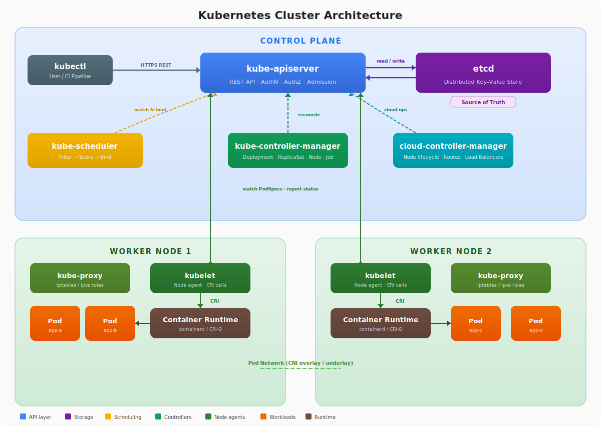

# Exercise 01 — Kubernetes Architecture Fundamentals

## Learning Objectives

By the end of this exercise you will be able to:

- Identify the control plane components and describe their individual roles
- Identify the worker node components and describe their individual roles
- Trace the path an API request takes from `kubectl` to persistent state
- Describe how the scheduler selects a node for a Pod
- Explain etcd's role and why it is used instead of a relational database
- List the kubelet's core responsibilities on a node

---

## Background

A Kubernetes cluster is divided into two planes: the **control plane**, which manages cluster state and makes global decisions, and the **data plane** (worker nodes), which runs the actual workloads.

<p align="center">
  
</p>

### Control Plane Components

| Component | Role |
|---|---|
| **kube-apiserver** | The single entry point for all cluster operations. Validates and processes REST requests, enforces authentication, authorisation, and admission control, then persists state to etcd. |
| **etcd** | A distributed key-value store that holds all cluster state. It is the source of truth; every other component derives its view of the world from etcd via the API server. |
| **kube-scheduler** | Watches for newly created Pods with no assigned node and selects the best node based on resource availability, affinity rules, taints, tolerations, and other constraints. |
| **kube-controller-manager** | Runs the built-in control loops (Deployment, ReplicaSet, Node, Job, etc.). Each controller watches desired state in etcd and reconciles actual state toward it. |
| **cloud-controller-manager** | Runs cloud-provider-specific control loops (node lifecycle, route management, load balancer provisioning). Separates cloud logic from the core Kubernetes release cycle. |

### Worker Node Components

| Component | Role |
|---|---|
| **kubelet** | An agent that runs on every node. It receives PodSpecs from the API server, ensures the described containers are running and healthy, and reports node and Pod status back. |
| **kube-proxy** | Maintains network rules on each node that implement Kubernetes Services (ClusterIP, NodePort, LoadBalancer) using iptables, ipvs, or nftables. |
| **Container Runtime** | The software that actually runs containers (containerd, CRI-O). The kubelet communicates with it via the Container Runtime Interface (CRI). |

---

## Step 1 — Inspect the control plane

List the Pods running in the `kube-system` namespace. On a kubeadm cluster, control plane components run as static Pods:

```bash
kubectl get pods -n kube-system
```

You should see Pods named with the pattern `<component>-<node-name>`, for example `kube-apiserver-controlplane`.

Check component health with the legacy endpoint (may be deprecated on newer clusters):

```bash
kubectl get componentstatuses
```

Expected output:

```
NAME                 STATUS    MESSAGE   ERROR
controller-manager   Healthy   ok
scheduler            Healthy   ok
etcd-0               Healthy   ok
```

Note: `componentstatuses` is deprecated as of Kubernetes 1.19. Use `kubectl get --raw /readyz` (see Step 3) for a supported health check.

---

## Step 2 — Explore the API server

`kubectl cluster-info` shows where the API server and CoreDNS are reachable:

```bash
kubectl cluster-info
```

The API server exposes every resource type it knows about. List all API resources:

```bash
kubectl api-resources
```

Resources fall into two categories — namespaced and cluster-scoped:

```bash
# Resources that live inside a namespace
kubectl api-resources --namespaced=true

# Cluster-scoped resources (Nodes, PersistentVolumes, ClusterRoles, etc.)
kubectl api-resources --namespaced=false
```

Each row shows the resource name, short names, API group, whether it is namespaced, and the Kind. The API server routes every `kubectl` call to the correct group/version/resource endpoint based on this registry.

---

## Step 3 — Understand etcd's role

All cluster state lives in etcd. The API server exposes health endpoints that proxy to etcd's own readiness and liveness checks:

```bash
kubectl get --raw /readyz
kubectl get --raw /healthz
```

A healthy cluster returns `ok` for both.

To get a sense of the volume and variety of objects etcd stores, list every object in the cluster by name:

```bash
kubectl get all --all-namespaces -o name | head -20
```

Every line represents a key in etcd. Controllers, the scheduler, and the kubelet all watch the API server (which watches etcd) and react when these keys change. Nothing in Kubernetes communicates directly with etcd — only the API server does.

---

## Step 4 — Observe the scheduler in action

Create a minimal Pod with no node constraints:

```bash
kubectl run scheduler-demo --image=nginx:alpine --restart=Never
```

Check which node the scheduler selected:

```bash
kubectl get pod scheduler-demo -o wide
```

The `NODE` column shows the placement decision. Inspect the events to see the scheduler's entry in the audit trail:

```bash
kubectl describe pod scheduler-demo
```

Look for the `Events` section at the bottom:

```
Events:
  Type    Reason     Age   From               Message
  ----    ------     ----  ----               -------
  Normal  Scheduled  5s    default-scheduler  Successfully assigned default/scheduler-demo to <node-name>
  Normal  Pulled     4s    kubelet            Container image "nginx:alpine" already present on machine
  Normal  Created    4s    kubelet            Created container scheduler-demo
  Normal  Started    4s    kubelet            Started container scheduler-demo
```

The `Scheduled` event is emitted by `default-scheduler` after it evaluates all nodes, runs filtering (removes nodes that cannot satisfy the Pod), and scoring (ranks remaining nodes). The highest-scoring node wins.

---

## Step 5 — Inspect node components

List nodes and their container runtimes:

```bash
kubectl get nodes -o wide
```

The `CONTAINER-RUNTIME` column shows the runtime in use (e.g., `containerd://1.7.x`).

Inspect a node in detail:

```bash
kubectl describe node <node-name>
```

Key sections to read:

- **Kubelet Version** — the kubelet binary version running on this node.
- **Capacity** vs **Allocatable** — total hardware vs what is available to workloads after system reservations.
- **Conditions** — `Ready`, `MemoryPressure`, `DiskPressure`, `PIDPressure`. A node is schedulable only when `Ready=True` and the pressure conditions are `False`.
- **Non-terminated Pods** — Pods currently running, with their resource requests.

---

## Step 6 — Trace an API request

Every `kubectl apply` follows this path:

1. **kubectl** serialises the object and sends a REST request to the API server.
2. **Authentication** — the API server verifies the caller's identity (certificate, token, or OIDC).
3. **Authorisation** — RBAC (or another authoriser) checks whether the caller is permitted to perform the operation on the target resource.
4. **Admission control** — mutating webhooks may modify the object; validating webhooks may reject it.
5. **Persist to etcd** — the object is written.
6. **Watch notification** — controllers and the scheduler receive a watch event and reconcile toward the new desired state.
7. **kubelet** — receives its PodSpec and instructs the container runtime to start the container.

Use `--dry-run=server` to exercise authentication, authorisation, and admission without writing to etcd:

```bash
kubectl run dry-run-demo --image=nginx:alpine --restart=Never --dry-run=server
```

If the request passes all three gates you will see:

```
pod/dry-run-demo created (server dry run)
```

Nothing is persisted, so nothing needs cleaning up.

After creating a real resource, watch controllers react by examining events sorted by time:

```bash
kubectl get events --sort-by='.lastTimestamp'
```

---

## Step 7 — Clean up

Delete the Pod created in Step 4:

```bash
kubectl delete pod scheduler-demo
```

Verify it is gone:

```bash
kubectl get pods
```

---

## Knowledge Check

Answer these questions without looking at the steps above:

1. Which control plane component is the only one that talks directly to etcd?
2. What are the three phases an API request passes through on the API server before being persisted to etcd?
3. A node shows `NotReady`. Which component on that node has most likely failed?
4. What is the difference between `kube-controller-manager` and `cloud-controller-manager`?
5. How does the scheduler decide which node to place a Pod on?
6. If you delete a Pod directly (not via a Deployment), what prevents Kubernetes from recreating it?
7. What does the kubelet use to know which Pods it should be running?
8. Why does Kubernetes use etcd rather than a regular SQL database?
9. A Pod is `Pending`. The scheduler log shows "no nodes available to schedule pods." What two categories of cause should you investigate?
10. What component is responsible for assigning a Pod's IP address on a node?

<details>
<summary>Answers</summary>

1. **kube-apiserver**. All other components (scheduler, controller-manager, kubelet) communicate with etcd exclusively through the API server. etcd is not directly accessible to any other component.

2. **Authentication, Authorisation, and Admission control** (in that order). Authentication verifies who the caller is; authorisation checks whether they are permitted to perform the action; admission controllers mutate or validate the object before it is written.

3. The **kubelet**. The kubelet is responsible for posting `NodeReady` heartbeats to the API server. If it crashes or loses connectivity the node transitions to `NotReady` after the grace period expires. kube-proxy failure can break Service networking but does not directly affect the `Ready` condition.

4. `kube-controller-manager` runs the core, provider-agnostic control loops (Deployment, ReplicaSet, Job, Namespace, etc.). `cloud-controller-manager` runs loops that integrate with a specific cloud provider: node lifecycle (detecting deleted VMs), route management, and cloud load balancer provisioning. Separating them allows cloud providers to release updates independently of the Kubernetes core.

5. The scheduler uses a two-phase process. **Filtering** eliminates nodes that cannot satisfy the Pod's hard requirements (insufficient CPU/memory, missing taints/tolerations, node affinity rules, port conflicts). **Scoring** ranks the remaining nodes using weighted scoring functions (resource balance, image locality, inter-Pod affinity, etc.). The node with the highest score is selected; ties are broken arbitrarily.

6. Nothing — Kubernetes will not recreate it. A bare Pod has no owning controller. The ReplicaSet controller watches for Pods owned by a ReplicaSet and recreates them if the count drops below the desired replica count. Without that owner reference, deletion is permanent.

7. The kubelet watches the API server for **PodSpecs** assigned to its node (via the `spec.nodeName` field). It also picks up static Pod manifests from a local directory on the node's filesystem (typically `/etc/kubernetes/manifests`), which is how control plane components run on kubeadm clusters.

8. etcd is a **distributed, consistent key-value store** that uses the Raft consensus algorithm to guarantee linearisable reads and writes across a cluster of replicas. This provides the strong consistency guarantees Kubernetes requires — concurrent watch events must reflect a total order of changes. A traditional SQL database can provide consistency but does not natively offer the watch/notify mechanism etcd exposes, which is central to how Kubernetes controllers react to state changes in real time.

9. Two categories to investigate: **(1) Node-side issues** — are all nodes tainted, at capacity (CPU, memory, or ephemeral storage), or marked unschedulable (`kubectl cordon`)? **(2) Pod-side constraints** — does the Pod have nodeSelector, node affinity, or toleration requirements that no node can satisfy? Run `kubectl describe pod <name>` and read the `Events` section; the scheduler emits a specific reason (e.g., `Insufficient cpu`, `node(s) had untolerated taint`) that pinpoints the cause.

10. The **container runtime** (e.g., containerd) in coordination with a **CNI plugin** (Container Network Interface, such as Calico, Cilium, or Flannel). When the kubelet asks the runtime to start a Pod, the runtime calls the configured CNI plugin, which allocates an IP from the node's Pod CIDR and wires up the network namespace. `kube-proxy` manages Service-level routing rules but does not assign Pod IPs.

</details>
